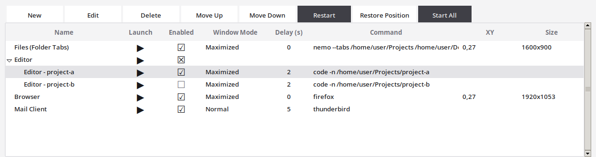
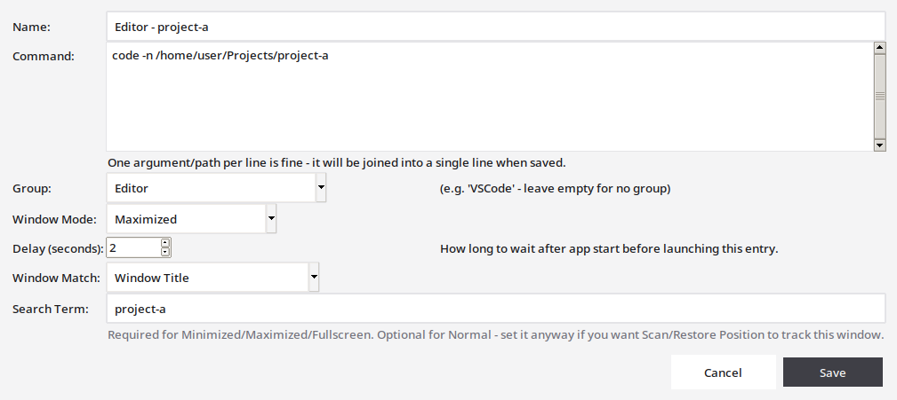

# Startup Launcher

A GUI to manage the programs started at login - replaces a plain bash startup
script with per-entry window placement, grouping, delayed starts, and window
position memory.

📖 **[User Manual](MANUAL.md)** (day-to-day usage) ·
🛠️ **[Technische Dokumentation](TECHNISCHE-DOKUMENTATION.md)** (deutsch, Architektur)

## Screenshots

**Main window** — grouped entries, per-row Launch/Enabled, sortable columns,
click-to-edit fields, and remembered window positions:



**New/Edit entry dialog:**



## Features

- Add/edit/delete/reorder login entries; group them (e.g. all VSCode
  windows) and start a whole group with one click
- Per-entry window mode (Normal, Minimized, Maximized, Fullscreen) applied
  via `wmctrl`, plus a per-entry startup delay (0-60s) to stagger heavy
  programs
- Double-click-to-edit table: Name, Command, Delay, and window XY/Size can
  all be edited directly in the table, no dialog needed (single click just
  selects the row, like anywhere else)
- Window position memory: scan open windows, save their position/size, and
  restore it per entry or group - with an opt-in "restore automatically at
  login" that only kicks in after a clean shutdown
- Enable/disable via checkboxes right in the table, with group-level cascade
- Sortable columns, live-reload if `entries.json` changes on disk
- Runs tray-only (GTK3), autostart toggle in the File/tray menu, and only
  one instance can ever run at a time
- Login autostart that repairs its own `.desktop` entry, waits for the
  desktop to finish coming up, and can start the launcher without starting
  the entries ("Launch the enabled entries automatically at login")
- Every start is recorded in `~/.local/state/startup-launcher/session.log`
  (**Help > Startup Log...**), so a login run that misbehaves leaves a trace

## Requirements

- Linux with a window manager exposing `wmctrl` (Cinnamon/GNOME/XFCE/etc.)
- `wmctrl` and `xprop` (window matching, scanning, and restoring positions)
- Python 3.9+ with `tkinter` (`python3-tk` on Debian/Ubuntu/Mint)
- GTK3 + PyGObject (`python3-gi`, `gir1.2-gtk-3.0`) for the system tray icon
  - optional: without it, the app falls back to a normal visible window
    when started manually (autostart launches always stay hidden either way)

## Usage

```bash
git clone https://github.com/joruf/startup-launcher.git
cd startup-launcher
chmod +x run.py
./run.py
```

`entries.json`, `window_geometry.json`, and `settings.json` hold your
personal data (your own commands/paths, window positions, preferences) and
are git-ignored - they're created automatically on first run, seeded from
`entries.example.json` if present, or empty otherwise. To start from the
bundled example entries instead of empty:

```bash
cp entries.example.json entries.json
```

See the **[User Manual](MANUAL.md)** for the full day-to-day
usage guide (table interactions, groups, delays, window position memory,
autostart, single-instance behavior).

## Look & Feel

The ttk theme (`ui/style.py`) is copied 1:1 from `devserver-commander`
(same zinc/neutral-gray palette, buttons, treeview), so both tools look
alike. Data lives in `entries.json`/`window_geometry.json`/`settings.json`
next to the script (all git-ignored - your personal data), read/written
through `json_store.py` for atomic writes and resilient reads. See the
**[Technische Dokumentation](TECHNISCHE-DOKUMENTATION.md)** for the full
architecture (module responsibilities, persistence, IPC/single-instance
design, data flow).

## Project Layout

```
startup-launcher/
├── run.py                     # thin entry point
├── paths.py                   # shared path constants
├── json_store.py              # atomic writes + resilient reads for the JSON files below
├── entries.json                # your data (git-ignored)
├── entries.example.json        # generic template, committed - copy to entries.json
├── window_geometry.json        # last-seen position/size per entry (git-ignored)
├── settings.json               # scan/login-launch/restore/clean-shutdown settings (git-ignored)
├── models/entries.py           # schema, default seed, JSON persistence
├── models/geometry.py          # window_geometry.json persistence
├── services/launcher.py        # process start + wmctrl window state + per-entry delay
├── services/geometry.py        # scan/restore window position via wmctrl
├── services/single_instance.py # single-instance lock (fcntl.flock)
├── services/instance_ipc.py    # Unix-socket "show yourself" IPC for the lock above
├── services/session_log.py     # append-only start/exit log (autostart diagnostics)
├── config/autostart.py         # manage the autostart desktop entry
├── config/settings.py          # settings.json persistence + clean-shutdown flag
├── ui/main_window.py           # main window (StartupLauncherApp)
├── ui/entry_dialog.py          # New/Edit dialog
├── ui/settings_dialog.py       # Settings dialog
├── ui/wrap_bar.py              # self-wrapping button bar
├── ui/style.py                 # ttk theme (copied from devserver-commander)
├── ui/tray.py                  # GTK3 system tray
├── ui/window_icon.py           # window/taskbar icon
├── resources/                   # icon + .desktop template
├── docs/screenshots/            # README screenshots
├── tests/                       # unittest suite - see Testing below
├── MANUAL.md                    # user guide
└── TECHNISCHE-DOKUMENTATION.md  # architecture reference (deutsch)
```

## Testing

```bash
# business logic (models/services/config/json_store) - no display needed
python3 -m unittest discover -s tests -p "test_json_store.py" -p "test_models_*.py" -p "test_config_*.py" -p "test_services_*.py" -v

# everything, including GUI regression tests (needs a real or virtual X11 display)
python3 -m unittest discover -s tests -v          # local machine with a real DISPLAY
xvfb-run -a python3 -m unittest discover -s tests -v   # headless (matches CI)
```

The suite covers the persistence layer (`json_store`, `models/`, `config/`)
and process/window-management services (`services/`) with mocked
`subprocess` calls, plus GUI regression tests for the main window (inline
editing, sorting, checkbox/group cascade, delete/move) and both dialogs -
all against real Tk widgets. GUI tests are skipped automatically wherever
`$DISPLAY` isn't set; CI runs the full suite under `xvfb-run` instead of
skipping it. See **[Technische Dokumentation](TECHNISCHE-DOKUMENTATION.md#6-tests)**
for what each test file covers and any known gaps.

CI runs the full suite on Ubuntu 22.04/24.04 (Python 3.11 and 3.12) on every
push and pull request. **Windows is not supported** (requires `wmctrl` /
Linux window management).

### Multi-OS matrix (local Linux host)

```bash
~/os-test-matrix/bin/test-project /path/to/startup-launcher
~/os-test-matrix/bin/test-project "$PWD" --only ubuntu-2404
```

On-demand Linux runners: [`OS Matrix`](.github/workflows/os-matrix.yml).
Results: `~/os-test-matrix/results/`.

## Migrating from an old bash autostart script

If you're switching to Startup Launcher from a previous plain-script
autostart entry (e.g. a `~/.config/autostart/*.desktop` that ran a
`.sh` file directly), remove or disable that old entry once Startup
Launcher's own autostart is on - otherwise every program starts twice at
login.
