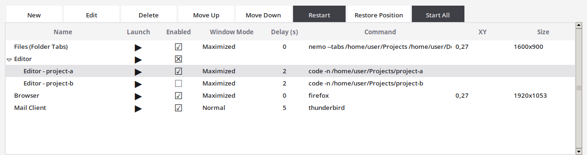
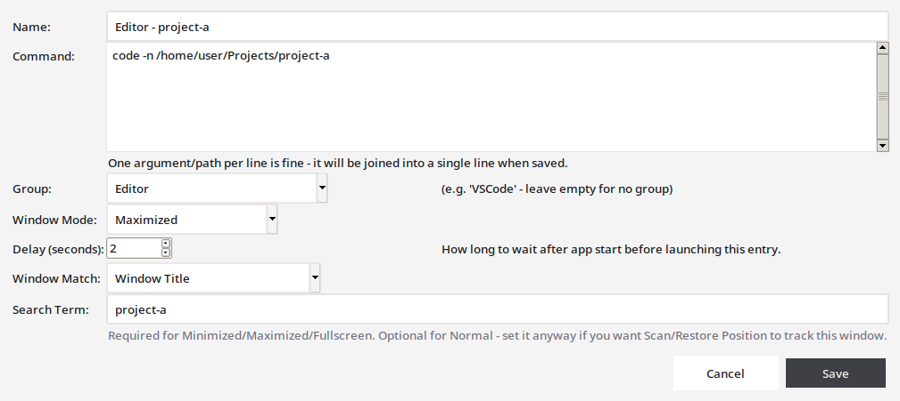

# Startup Launcher

A GUI to manage the programs started at login - replaces a plain bash startup
script with per-entry window placement, grouping, delayed starts, and window
position memory.

📖 **[User Manual](MANUAL.md)** (day-to-day usage) ·
🛠️ **[Technische Dokumentation](TECHNISCHE-DOKUMENTATION.md)** (deutsch, Architektur)

## Screenshots

**Main window** — grouped entries, per-row Launch/Enabled, sortable columns,
click-to-edit fields, and remembered window positions:



**New/Edit entry dialog:**



## Features

- Add/edit/delete/reorder login entries; group them (e.g. all VSCode
  windows) and start a whole group with one click
- Per-entry window mode (Normal, Minimized, Maximized, Fullscreen) applied
  via `wmctrl`, plus a per-entry startup delay (0-60s) to stagger heavy
  programs
- Double-click-to-edit table: Name, Command, Delay, and window XY/Size can
  all be edited directly in the table, no dialog needed (single click just
  selects the row, like anywhere else)
- Window position memory: scan open windows, save their position/size, and
  restore it per entry or group - with an opt-in "restore automatically at
  login" that only kicks in after a clean shutdown
- Enable/disable via checkboxes right in the table, with group-level cascade
- Sortable columns, live-reload if `entries.json` changes on disk
- Runs tray-only (GTK3), autostart toggle in the File/tray menu, and only
  one instance can ever run at a time
- Login autostart that repairs its own `.desktop` entry, waits for the
  desktop to finish coming up, and can start the launcher without starting
  the entries ("Launch the enabled entries automatically at login")
- Every start is recorded in `~/.local/state/startup-launcher/session.log`
  (**Help > Startup Log...**), so a login run that misbehaves leaves a trace

## Requirements

- Linux with a window manager exposing `wmctrl` (Cinnamon/GNOME/XFCE/etc.)
- `wmctrl` and `xprop` (window matching, scanning, and restoring positions)
- Python 3.9+ with `tkinter` (`python3-tk` on Debian/Ubuntu/Mint)
- GTK3 + PyGObject (`python3-gi`, `gir1.2-gtk-3.0`) for the system tray icon
  - optional: without it, the app falls back to a normal visible window
    when started manually (autostart launches always stay hidden either way)

## Usage

```bash
git clone https://github.com/joruf/startup-launcher.git
cd startup-launcher
chmod +x run.py
./run.py
```

`entries.json`, `window_geometry.json`, and `settings.json` hold your
personal data (your own commands/paths, window positions, preferences) and
live in `~/.config/startup-launcher/` (`$XDG_CONFIG_HOME` is honoured) -
outside the checkout, so a checkout and the single-file executable share them.
They're created automatically on first run, seeded from `entries.example.json`
if present, or empty otherwise. Older versions kept them in the project
directory: on the first start of a checkout without the new files they are
copied from there once, and the old files are left in place. To start from the
bundled example entries instead of empty:

```bash
mkdir -p ~/.config/startup-launcher
cp entries.example.json ~/.config/startup-launcher/entries.json
```

See the **[User Manual](MANUAL.md)** for the full day-to-day
usage guide (table interactions, groups, delays, window position memory,
autostart, single-instance behavior).

`./run.py --version` prints the version (see [Versioning](#versioning)) and
exits without opening a window.

### Single-file executable (no Python needed)

Startup Launcher can also be built as one executable file that carries
Python, tkinter and the GTK bindings for the tray icon. One script does the
whole build:

```bash
./build-exe.py          # -> dist/startup-launcher-linux-x86_64-<version>-build<build>
```

The file name carries the version, e.g. `startup-launcher-linux-x86_64-0.4.6-build17`.

- **Linux only.** Window handling needs `wmctrl`/`xprop` (X11), the
  single-instance lock `fcntl` and a Unix socket, the autostart the
  freedesktop `~/.config/autostart`. A Windows version would need a port, not
  just a build.
- **The file runs on systems with the same or a newer glibc as the build
  machine.** Build on the oldest system you want to support. The release
  workflow uses Ubuntu 22.04.
- **Build machine:** `python3-venv`, `python3-tk`, `python3-gi` and
  `gir1.2-gtk-3.0`. The system Python is used, because only it sees
  PyGObject; `build-exe.py` links it into its private build environment in
  `build/exe/`. Without PyGObject the build still works, but has no tray icon.
- `--clean` rebuilds that build environment, `--keep-env` reuses it without
  updating.
- After downloading, make the file executable once:
  `chmod +x startup-launcher-linux-*`.
- **Run Automatically at Startup** from the executable writes an autostart
  entry that starts the executable itself (no interpreter, no `Path=`); its
  icon is copied to `~/.local/share/startup-launcher/`. Whichever variant -
  checkout or executable - starts last points the entry at itself.

What stays outside the file, on purpose: `wmctrl` and `xprop`, and of course
every program you configure. They are started with the system's own library
paths, never with the ones the executable unpacks for itself.

Every push to `main` runs `.github/workflows/release-exe.yml`. It builds the
file on GitHub (Ubuntu 22.04) and publishes it as the release
`v<version>-build<build>`; the build number changes with every commit, so
every push gets its own release. Startup Launcher has no updater: download a
newer file to update.

## Versioning

The number is never typed, it is derived from the commit history by `version.py`:

| part | meaning |
|---|---|
| major | raised by hand, only for a release that justifies it |
| minor | commits that added a new module under `ui/` or `services/` (`__init__.py` aside) - a new capability |
| patch | commits since that last happened |
| build | total number of commits |

The first commit brought the whole application and counts as the first new
module, so the first working state is `0.1.x`. Renamed modules do not count.
**Help > About** and `--version` show the full form together with the short
hash and the date of the last commit, so a number in a bug report leads back
to an exact commit.

The derived value is cached in a `VERSION` file, which is **not** checked in -
it is derived, and a checked-in copy would be stale one commit later. The
commit hook rewrites it, so an installation copied without `.git` still knows
its version; the single-file executable carries the file written by
`build-exe.py`. Activate the hook once per checkout:

```bash
git config core.hooksPath .githooks
python3 version.py            # prints the current version
python3 version.py --write    # what the hook does
```

Set `STARTUP_LAUNCHER_VERSION` to pin a value for a test or a one-off run.
Without a history, without a `VERSION` file and without that variable the
version reads `unknown` - an invented `0.0.0` would look real and send bug
reports the wrong way.

## Look & Feel

The ttk theme (`ui/style.py`) is copied 1:1 from `devserver-commander`
(same zinc/neutral-gray palette, buttons, treeview), so both tools look
alike. Data lives in `entries.json`/`window_geometry.json`/`settings.json`
in `~/.config/startup-launcher/` (your personal data), read/written
through `json_store.py` for atomic writes and resilient reads. See the
**[Technische Dokumentation](TECHNISCHE-DOKUMENTATION.md)** for the full
architecture (module responsibilities, persistence, IPC/single-instance
design, data flow).

## Project Layout

```
startup-launcher/
├── run.py                     # thin entry point
├── paths.py                   # shared path constants
├── json_store.py              # atomic writes + resilient reads for the JSON files below
├── version.py                 # derives the version from the commit history; no number is typed
├── build-exe.py               # builds the single-file executable with PyInstaller
├── .githooks/post-commit      # refreshes the VERSION file after every commit
├── entries.example.json        # generic template, committed - copy to ~/.config/startup-launcher/entries.json
├── entries.json                # former location of your data (git-ignored), copied once to ~/.config/startup-launcher/
├── window_geometry.json        # former location, as above: last-seen position/size per entry
├── settings.json               # former location, as above: scan/login-launch/restore/clean-shutdown settings
├── models/entries.py           # schema, default seed, JSON persistence
├── models/geometry.py          # window_geometry.json persistence
├── services/launcher.py        # process start + wmctrl window state + per-entry delay
├── services/geometry.py        # scan/restore window position via wmctrl
├── services/single_instance.py # single-instance lock (fcntl.flock)
├── services/instance_ipc.py    # Unix-socket "show yourself" IPC for the lock above
├── services/session_log.py     # append-only start/exit log (autostart diagnostics)
├── config/autostart.py         # manage the autostart desktop entry
├── config/settings.py          # settings.json persistence + clean-shutdown flag
├── ui/main_window.py           # main window (StartupLauncherApp)
├── ui/entry_dialog.py          # New/Edit dialog
├── ui/settings_dialog.py       # Settings dialog
├── ui/wrap_bar.py              # self-wrapping button bar
├── ui/style.py                 # ttk theme (copied from devserver-commander)
├── ui/tray.py                  # GTK3 system tray
├── ui/window_icon.py           # window/taskbar icon
├── resources/                   # icon + .desktop template
├── docs/screenshots/            # README screenshots
├── tests/                       # unittest suite - see Testing below
├── MANUAL.md                    # user guide
└── TECHNISCHE-DOKUMENTATION.md  # architecture reference (deutsch)
```

## Testing

```bash
# business logic (models/services/config/json_store) - no display needed
python3 -m unittest discover -s tests -p "test_json_store.py" -p "test_models_*.py" -p "test_config_*.py" -p "test_services_*.py" -v

# everything, including GUI regression tests (needs a real or virtual X11 display)
python3 -m unittest discover -s tests -v          # local machine with a real DISPLAY
xvfb-run -a python3 -m unittest discover -s tests -v   # headless (matches CI)
```

The suite covers the persistence layer (`json_store`, `models/`, `config/`)
and process/window-management services (`services/`) with mocked
`subprocess` calls, plus GUI regression tests for the main window (inline
editing, sorting, checkbox/group cascade, delete/move) and both dialogs -
all against real Tk widgets. GUI tests are skipped automatically wherever
`$DISPLAY` isn't set; CI runs the full suite under `xvfb-run` instead of
skipping it. See **[Technische Dokumentation](TECHNISCHE-DOKUMENTATION.md#6-tests)**
for what each test file covers and any known gaps.

CI runs the full suite on Ubuntu 22.04/24.04 (Python 3.11 and 3.12) on every
push and pull request. **Windows is not supported** (requires `wmctrl` /
Linux window management).

### Multi-OS matrix (local Linux host)

```bash
~/os-test-matrix/bin/test-project /path/to/startup-launcher
~/os-test-matrix/bin/test-project "$PWD" --only ubuntu-2404
```

On-demand Linux runners: [`OS Matrix`](.github/workflows/os-matrix.yml).
Results: `~/os-test-matrix/results/`.

## Migrating from an old bash autostart script

If you're switching to Startup Launcher from a previous plain-script
autostart entry (e.g. a `~/.config/autostart/*.desktop` that ran a
`.sh` file directly), remove or disable that old entry once Startup
Launcher's own autostart is on - otherwise every program starts twice at
login.
